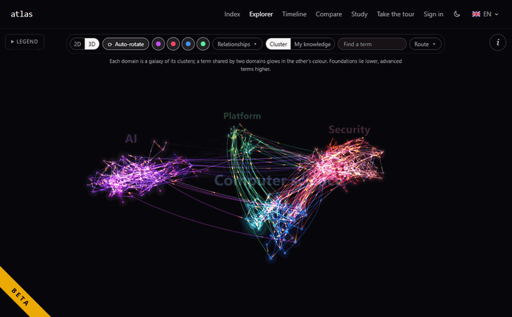
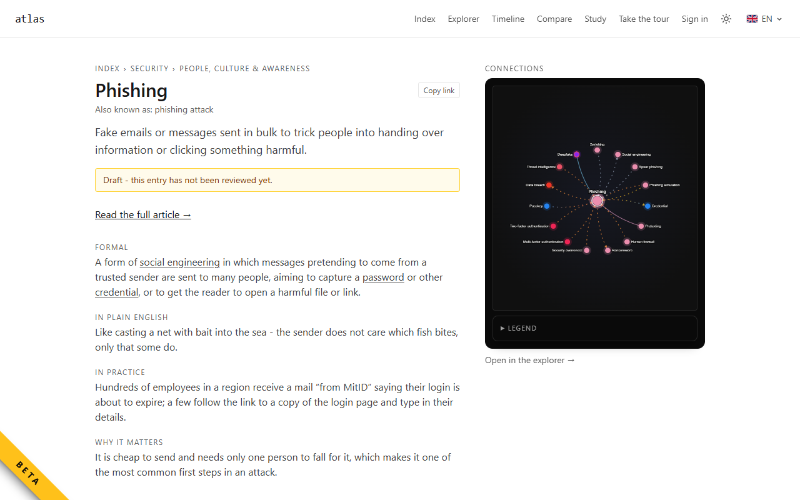
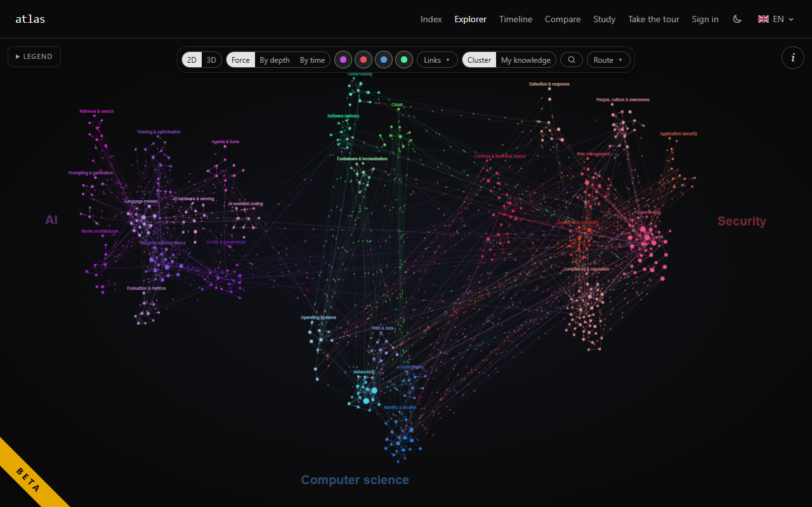
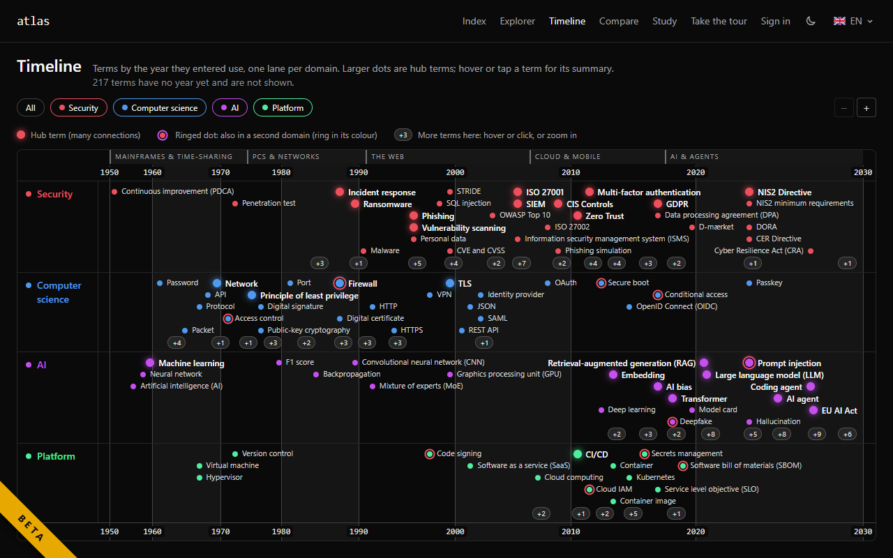

# Atlas

**A bilingual (English + Danish) technical dictionary you can explore as a map.**



**Live site:** https://cmaintz.github.io/tech-atlas/

## What it is

Atlas explains about 420 technical terms across security, computer science, AI and
platform engineering, in English and Danish side by side. Every term is linked to others
by typed, sourced relationships ("is a kind of", "requires", "contrasts with" and so on),
so the dictionary doubles as a knowledge graph you can navigate.

It is anchored to a real Danish cybersecurity (GRC) course and written first for
**Danish learners of cybersecurity and governance, risk and compliance** who need the
English terms and the Danish ones, explained in plain language. It is built to grow
into the wider CS, AI and platform domains.

## Features

- **Dictionary** - every term has four facets: a formal definition, a plain-language
  explanation, an example in practice, and why it matters. Many terms also have a longer
  technical deep-dive article. Summaries use a closed vocabulary (plain words plus other
  defined terms), enforced by a lint.
- **Explorer** - the whole graph in 2D (force, by depth, by time) or 3D, with flowing
  relationship edges, auto-rotate, domain and relationship filters, a route finder
  between two terms, and a side panel for the selected term.
- **Timeline** - terms by the year they entered use, one lane per domain.
- **Compare** - "don't confuse these" pages for every pair of contrasting terms.
- **Study** - quizzes generated from the graph plus a hand-written question bank, with
  spaced repetition to bring terms back when they are due.
- **Search** - typo-tolerant bilingual search, plus search by meaning (semantic search).
- **Accounts and sync** - optional sign-in with GitHub or LinkedIn to keep study
  progress across devices. Everything works without an account.
- **Light and dark theme**, and every page in **English and Danish** (`/en/`, `/da/`).
- **Open data** - every term as JSON and CSV, Anki decks, the graph and RSS feeds (see
  [Data](#data)).

## Screenshots

| Term page | Explorer (2D) | Timeline |
| --- | --- | --- |
|  |  |  |

## Tech stack

- [Astro 7](https://astro.build/), static-first, route-based i18n (`/en/`, `/da/`)
- [Preact](https://preactjs.com/) islands; [Cytoscape.js](https://js.cytoscape.org/)
  for the 2D graph and [3d-force-graph](https://github.com/vasturiano/3d-force-graph)
  for the 3D Explorer
- [Tailwind CSS v4](https://tailwindcss.com/); [MiniSearch](https://lucaong.github.io/minisearch/)
  for search
- Content as bilingual YAML validated by [Zod](https://zod.dev/) (`app/src/schema.ts`)
- [Supabase](https://supabase.com/) (auth, progress sync, pgvector) and
  [Cloudflare Workers AI](https://developers.cloudflare.com/workers-ai/) (`bge-m3`
  embeddings) for the optional backend
- [Vitest](https://vitest.dev/), Prettier, and a custom content lint; gated by
  Foundry (`mise run gate`)
- Hosted on GitHub Pages

## Architecture in brief

Atlas is a **static site**. The build reads the YAML terms, derives the graph (depth,
inverse edges, visual weight) and renders every page for both languages. All reading,
exploring and studying runs in the browser, and progress is kept locally.

An **optional backend** adds two things on top:

- **Accounts and sync** through Supabase Auth (GitHub, LinkedIn) with Row Level Security.
- **Search by meaning** through a Supabase Edge Function that embeds the query with
  Cloudflare Workers AI (`bge-m3`) and matches it against pre-computed term vectors.

If the backend is not configured, the site still works; those two features are simply
hidden. Setup: [docs/SUPABASE_SETUP.md](docs/SUPABASE_SETUP.md). Security model:
[docs/SECURITY.md](docs/SECURITY.md). Reporting a vulnerability: [SECURITY.md](SECURITY.md).

The spec and decisions live in [`design/`](design/) (`SPEC.md`, `adr/`,
`UNIFIED_VISION.md`, `AUTONOMOUS_DECISIONS.md`). When spec and code disagree, the spec
wins.

## Getting started

Prerequisites: [mise](https://mise.jdx.dev/) (it installs the pinned Node and gitleaks).

```sh
mise install                               # pinned tools from mise.toml
cd app
ONNXRUNTIME_NODE_INSTALL=skip npm ci       # skips the ONNX runtime binary download
npm run dev                                # dev server at http://localhost:4321/tech-atlas/
```

From the repo root:

```sh
mise run fix     # format
mise run gate    # lint -> typecheck -> test (incl. the production build) -> audit
```

A change is done when `mise run gate` is green. More commands (content lint, graph
build, embeddings) are in [app/README.md](app/README.md); the working rules for
contributors and agents are in [AGENTS.md](AGENTS.md).

## Writing content

Terms, articles and quiz questions are YAML files under `app/src/content/`. The guide
is [app/content/AUTHORING.md](app/content/AUTHORING.md): the four facets, the closed
vocabulary, the 12 relationship types and how to write questions.

Every new entry starts as `draft: true` and shows a "not reviewed yet" banner. A human
reviewer checks it and flips the flag. The site's **Review** page (`/en/review/`) lists
the drafts still waiting, grouped by cluster, with an edit link for each.

## Project status

**Beta.** The site, explorer, study tools and backend are in place. Much of the content
was drafted with AI assistance and is being reviewed by hand, entry by entry; until an
entry is reviewed it is marked as a draft on the site. Corrections are welcome as issues
or pull requests.

## Data

The site publishes its content as open data: every term as JSON (`/api/terms.json`,
`/api/terms/<folder>/<id>.json`), a CSV (`/api/terms.csv`), Anki import files per
language, the derived graph (`/graph.json`) and an RSS feed of new terms per language.
The list, with formats, is on the site's **Data** page (`/en/data/`, `/da/data/`).

## License

- **Code:** MIT, see [LICENSE](LICENSE).
- **Content** (terms, articles, allowed-words lists and the published data):
  [CC BY-SA 4.0](https://creativecommons.org/licenses/by-sa/4.0/), see
  [CONTENT-LICENSE.md](CONTENT-LICENSE.md) for the scope, the attribution line and the
  reasoning.

## Credits

Made by **Christoffer Maintz Andersen** -
[GitHub](https://github.com/CMaintz) -
[LinkedIn](https://www.linkedin.com/in/christoffer-maintz/).
