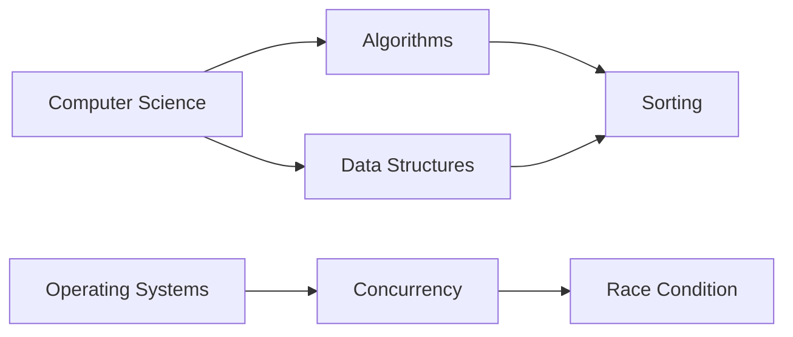

# Executive Summary

A comprehensive technical glossary site should draw from authoritative sources (e.g. standards bodies, academic glossaries, vendor docs) and present clear definitions with examples and diagrams.  Learning and review features (quizzes/flashcards, spaced repetition) help reinforce knowledge.  Structurally, terms should be organized in taxonomies/ontologies (broader/narrower/related) and prerequisite graphs, all supported by a rich data schema (term, aliases, definition, examples, code, diagrams, related terms, difficulty, tags, sources, revisions, etc.).  The UX must support discovery (search with autocomplete, faceted filters by field/difficulty, A–Z or hierarchical browsing) and guided learning paths.  Content reuse requires careful licensing: for example, NIST (US gov) definitions are public domain, Wikipedia content is CC BY‑SA (requiring attribution and share-alike), and many open educational resources (e.g. MIT OCW) use CC licenses.  Practical tools include the Wikipedia/Wikidata APIs and dumps, DBpedia/SPARQL, arXiv API, and vendor document APIs or downloadable docs.  Visualization options range from Mermaid flowcharts for hierarchies/prerequisites to interactive network graphs for complex ontologies.  Finally, community features (revision history, talk pages, moderation, reputation/voting) and assessment analytics (tracking quiz performance, spaced-repetition scheduling) further enhance usability and learning.  The following report details each of these aspects with examples and sources.  

## 1. Authoritative Sources by Field

Key sources differ by discipline, but authoritative references include standards organizations, academic glossaries/textbooks, vendor docs, and vetted community sites:

- **Computer Science (CS):**  **Wikipedia’s “Glossary of computer science”** (crowdsourced but extensive) and high-quality textbooks (e.g. *CLRS* for algorithms).  Community tutorials like *Real Python*’s Computer Science Glossary provide concise definitions (e.g. “Abstract Data Type (ADT): … operations it supports…”).  Official classifications (e.g. ACM Computing Classification Scheme) define taxonomies, though not easily browsed online.  Authoritative content: *NIST* (for computing-related standards), the online Oxford/IEEE reference works (often paid), and academic course lecture notes (e.g. MIT OpenCourseWare) are valuable.  

- **Software Engineering (SE):**  IEEE/ACM standards (e.g. ISO/IEC 24765 Systems and Software Engineering Vocabulary, or the now-legacy IEEE Std 610.12) are definitive, though not free.  SE bodies like the *Software Engineering Body of Knowledge (SWEBOK)* list key terms.  Reputable sources include *The Mythical Man-Month* or *SEI Sate-of-the-art* publications.  Well-known online glossaries (e.g. *Real Python*’s Software Engineering glossary) cover design patterns, testing, etc.  QA sites (StackExchange, CS communities) also elaborate terms in context.  

- **Platform Engineering / Cloud:**  Official definitions from NIST (e.g. NIST SP 800-145 for cloud computing) and ISO/IEC cloud computing standards.  The Cloud Native Computing Foundation’s **Cloud Native Glossary** (CNCF) is a collaborative, up-to-date list of cloud/DevOps terms, with tags for categories (e.g. “API”, “DevOps”, “Kubernetes”).  Vendor glossaries (AWS, Azure, Google Cloud) define their platform terms.  References like *The Google SRE Book* or *Azure Architecture Center* act as quasi-glossaries.  

- **Artificial Intelligence (AI):**  Government and academic glossaries exist.  For example, the US Government’s *AI.mil Glossary* and MIT Media Lab’s **AI Glossary** provide definitions of AI terms (e.g. “Artificial Intelligence: development of systems that can perform tasks requiring human intelligence”).  Wikipedia’s AI-related entries and textbooks (e.g. Russell & Norvig) are key.  Vendor/consortia sources: e.g. *Google AI Glossary*, *Oxford’s AI resources*.  Educational glossaries (e.g. CIRCLS “AI Glossary for Educators”) also distill key concepts.  

- **Cybersecurity:**  **NIST/NCSC glossaries** are gold standards.  NIST’s CSRC glossary defines terms like “encryption”, “confidentiality” with citations to SP 800-series (e.g. *cloud computing* defined per NIST SP 800-145).  ISO/IEC 27000 series provides security vocabulary.  The **OWASP Glossary** covers web security terms; *SANS Institute* and *(ISC)²* publications list fundamental concepts.  Government cybersecurity sites (e.g. US CISA, UK NCSC) offer glossaries.  Certified-community resources (e.g. *(ISC)² Certified in Cybersecurity* flashcards) show how terms are taught in practice.  

Each field’s list would begin with standards and recognized authorities, followed by textbooks and finally curated community pages.  For example, a “Computer Science Glossary” might rank NIST and ISO first (for formal definitions), then ACM/IEEE and popular textbook sites, and lastly community sites like Wikipedia or specialized blogs. (All URL sources are cited below in context.)  

## 2. Glossary Sites with Definitions, Examples, Diagrams, References

Several online sites illustrate effective glossary entries:

- **Tutorialspoint (Data Structures Glossary):** Provides concise definitions with real-world examples and diagrams.  For instance, its **Queue** entry defines FIFO (“A queue is a linear data structure…first in first out”) and shows a picture of cars in a single-lane queue.  It then includes a labeled block diagram with *Front* and *Rear* pointers illustrating FIFO operations.  These diagrams (e.g. [**cars in a FIFO queue**][83]) reinforce the definition visually.  The page also lists “Related Links” and references within the text, serving as canonical pointers.  

   *Tutorialspoint’s “Queue” entry illustrates the FIFO principle with a diagram of cars in a one-way line.*  

- **Real Python (Glossary Pages):** Although focused on Python, Real Python’s Computer Science Glossary contains crisp definitions of general CS terms.  Example: *“Algorithm – A finite sequence of well-defined steps…returns the right output for every valid input”*.  These entries often include diagrams; e.g., the *Algorithm* page shows a flowchart image (“From Input to Output in Finite Steps”).  Each glossary term links to deeper tutorial content for examples.  Real Python cites references and reviewer notes for credibility.  (Sample definitions: *“Abstract Data Type (ADT): A model of a data structure…”*; *“Algorithm: A finite sequence…”*.)

- **GeeksforGeeks (GfG):** Popular for programming, GfG has glossary-like tutorial pages.  Its **Queue Data Structure** page begins with *“A Queue Data Structure follows FIFO…”* and explains uses (e.g. buffering).  It includes step-by-step sections (introduction, operations, array/linked implementation) plus code snippets.  Although GfG pages are long, each term is clearly defined up front and illustrated in context.  GfG also offers “Practice Problems” and “Quizzes” sections (see next section) to test understanding.

- **IBM Developer/Oracle/Microsoft Docs:** Vendor documentation often includes glossaries or term popups.  IBM Developer’s glossary or Azure docs explain terms with examples and sometimes diagrams.  For example, Microsoft’s Azure docs define cloud concepts with diagrams (though not easily scrapable, they are authoritative).  These are vendor-specific but often near-layman.  (We cite general uses of examples, e.g. **IBM Cloud Docs Glossary**.)

- **OWASP Glossary:** The OWASP Foundation lists security terms succinctly (e.g. “XSS – a vulnerability where attackers inject scripts…”).  Each entry links to deeper articles and includes examples of attack scenarios.

- **Academic Course Sites:** University course pages (often on GitHub or .edu sites) sometimes have glossary sections.  For example, MIT OpenCourseWare or Stanford class notes occasionally include definitional lists of terms, with links to reading.  These are curated by professors and often accurate.

- **NIST Glossaries:** NIST’s *Computer Security Resource Center* publishes glossaries with multiple sourced definitions.  For instance, it defines “cloud computing” using NIST SP 800-145 language (with citations).  These entries may be formal but are authoritative; they often list synonyms and references to standards.

These examples illustrate the pattern: **concise definition, followed by examples or analogies, visual aids (diagrams, flowcharts), and references or links**.  Tutorialspoint’s example queue diagrams and Real Python’s algorithm flowchart are illustrative of how definitions can be reinforced visually and contextually.

## 3. Quiz/Flashcard Sites and Structures

Structured study tools help reinforce glossary learning.  Common formats include:

- **Multiple-Choice Quizzes:**  Sites like *GeeksforGeeks* embed MCQ quizzes at the end of tutorials.  Example: GfG’s “Quizzes on Queue” page asks questions like “A queue is first-in-first-out, last-in-first-out, etc.” with 4 choices.  The question is listed with numbered options, and the user selects the correct one.  Answers are given after submission.  Such quizzes often appear as standalone pages or widgets linked from glossary entries.

   *GeeksforGeeks “Quizzes on Queue” shows multiple-choice questions (question text followed by four answer options) that test comprehension of the term.*

- **Flashcards (Term⇄Definition):**  Tools like Quizlet, Flashcards.io, Brainscape, Anki, etc., host user-compiled decks.  For instance, Flashcards.io has a *“Cyber Security Flashcards”* set where each card presents a term (e.g. **Access Control**) and the definition on flip side.  These sites present terms as headings, with definitions in text below (see [96]).  Most allow tagging decks by subject and ordering cards by category.  Anki decks (open-source) can also be found for CS/cyber topics.

   *Flashcards.io example: the “Cyber Security Flashcards” deck lists terms (Access Control, MAC, DAC, etc.) with their definitions, in a simple term→definition format.*

- **Q&A or Practice Problems:**  Some platforms (StackExchange, Hackerrank, Coursera quizzes) embed concept questions.  For example, Coursera often includes quick “concept check” quizzes after lessons, or platforms like Khan Academy have short quizzes on terms (e.g. define “bitwise AND”).  These may mix multiple choice, true/false, or short answer.

- **Structured Flashcard Layout:**  The *(ISC)² Cybersecurity flashcards* on GitHub present definitions as prompts and terms as answers.  They use a simple markdown format with the definition (preceded by a number and a `>` symbol indicating the answer).  E.g.: *“1. Security commensurate with the risk ... > Adequate Security”*.  This style is easily exported to flashcard apps.

- **Learning Sites with Embedded Qs:**  Some e-learning platforms (edX, Udemy) include quizzes after glossary sections.  For example, a Data Structures MOOC might show a definition of “queue” then ask “Which of these is a valid queue operation?” in a check-your-knowledge quiz.

In summary, quiz/flashcard formats include MCQs (like GfG’s [29]), direct term-definition flashcards (like [96] or [34]), and interactive platform quizzes. They are typically structured as **term (or question) → multiple answers or free-response → immediate feedback**.

## 4. Modelling Term Relationships (Hierarchies, Ontologies, Prerequisites)

Glossary terms can be organized semantically in several ways:

- **Hierarchies/Taxonomies:**  Many fields have taxonomies (parent–child categories).  E.g. ACM CCS organizes topics hierarchically.  In glossaries, this is often implemented with “broader term”/“narrower term” links.  Standards for glossaries (ISO 2788, 5964) use **Broader Term (BT)** and **Narrower Term (NT)** labels.  For example, an entry might list *BT: “Data Structure”, NT: “Queue”*, indicating *Queue* is a specific kind of data structure.  The ISO standard notes: *“hierarchy is expressed by BT (Broader Term) and NT (Narrower Term)”*.  Similarly, the ACM CCS vocabulary (via its SKOS-based service) shows e.g. *“Computing standards…“ Broader Terms: Document types”*, confirming hierarchical categorization.

- **Associative Links:**  Non-hierarchical relations (e.g. “see also”, “related concept”) are handled with **Related Term (RT)**.  ISO defines RT as a “reciprocal relationship… not hierarchical”.  In practice, a term like “compiler” might have RTs “programming language” and “linker”.  SKOS (Simple Knowledge Organization System) formalizes these with `skos:broader`, `skos:narrower`, and `skos:related` properties.

- **Ontologies (RDF/OWL):**  For richer semantics, terms can be classes or instances in an ontology.  Relationships like subclass (is-a) or part-of can be encoded in OWL.  For example, the snippet below shows how an ontology might state that *HighOrderLanguage* is a subclass of *ProgrammingLanguage*:
  ```xml
  <owl:Class rdf:about="#HighOrderLanguage">
    <rdfs:subClassOf rdf:resource="#ProgrammingLanguage"/>
  </owl:Class>
  ``` 
  This XML/OWL example (from [44]) explicitly encodes a taxonomy.

- **Prerequisite Graphs:**  In educational contexts, terms often have “prerequisites” (one concept required to understand another).  This can be modeled as a directed acyclic graph (DAG).  For example, “Algorithms” might point to prerequisites like “Discrete Math” and “Data Structures”.  (Khan Academy’s “Knowledge Map” is a real-world example: it links exercises/topics by prerequisite.)  Prerequisite graphs help in recommending learning paths.

- **Abstraction Levels:**  Some terms relate by abstraction.  E.g. *High-level language* vs *Assembly language* vs *Machine code*.  These can be linked in a “levels” chain.  This is a form of taxonomy or subclass (low-level vs high-level languages).

- **Cross-Field Links:**  A comprehensive glossary might link a term in one domain to related terms in another.  For instance, *“Model”* in AI might link to *“Data Model”* in software engineering.  These cross-field links act like RTs in a multi-domain ontology.

*Visual example (Mermaid chart):* A simple directed graph can illustrate such relations. For instance:



This Mermaid diagram (above) shows “Computer Science” branching to “Data Structures” and “Algorithms”; “Algorithms” leads to “Sorting”, which also links back from “Data Structures”. “Operating Systems” leads to “Concurrency” and then to “Race Condition”. Arrows can be labeled (e.g. `-- "prerequisite" -->`) or styled (dotted for associative). Hierarchies are typically shown as trees (or “graph TD/LR”), while complex ontologies might use interactive network graphs (e.g. d3.js).  

In practice, one could use **SKOS** for thesaurus-style (BT/NT/RT) relationships, or **OWL ontologies** for formal hierarchies. Many knowledge graph tools (Wikidata, DBpedia) expose semantic links among terms. For example, Wikidata describes many concepts with `wdt:P279` (subclass) links. 

## 5. Entry Data Model (Schema)

A robust glossary entry should store multiple fields.  A recommended JSON-like schema might include:

| Field            | Type                    | Purpose                                    | Example                            |
|------------------|-------------------------|--------------------------------------------|------------------------------------|
| **term**         | string                  | Canonical name of the concept              | `"Queue"`                          |
| **aliases**      | array[string]           | Alternate names, acronyms, synonyms        | `["FIFO queue"]`                   |
| **definition**   | string (rich text)      | Formal definition/description              | `"A linear data structure... FIFO."` |
| **examples**     | array[string or object] | Illustrative examples or analogies         | `["Cars lining up at toll booths."]` |
| **code_snippets**| array[string]           | Example code (if applicable)              | `"enqueue(queue, x);"`             |
| **diagrams**     | array[string] (URLs)    | Diagrams or images illustrating concept    | `"https://example.com/queue.png"`  |
| **related_terms**| array[obj]              | Related concepts with relation type        | `[{"term":"Stack","relation":"contrast"}]` |
| **difficulty**   | string (enum)           | Learner level/complexity                  | `"Intermediate"`                   |
| **tags**         | array[string]           | Categories, fields or keywords            | `["data structure", "CS theory"]`  |
| **sources**      | array[string] (URLs)    | References or URLs for definitions         | `["https://en.wikipedia.org/wiki/Queue_(ADT)"]` |
| **revision_history** | array[obj]         | Edit history (timestamps, authors, notes)  | `[{"date":"2026-09-01","editor":"Alice","changes":"Updated code."}]` |
| **learning_items**   | array[obj]         | Linked quiz/flashcard IDs or resources     | `[{"type":"quiz","id":123}]`       |
| **assessment_items** | array[obj]         | Questions (e.g. flashcards or quiz Q&A)    | `[{"question":"What does FIFO mean?","answer":"First In, First Out"}]` |
| **metadata**         | object              | Other meta (created date, license, etc.)   | `{"created":"2026-05-01","license":"CC-BY-4.0"}` |

Each entry can thus contain multiple examples, code blocks, images, and structured links. 

**Example JSON entry:**  
```json
{
  "term": "Queue",
  "aliases": ["FIFO queue"],
  "definition": "A linear data structure where the first element added is the first one to be removed (First-In-First-Out).",
  "examples": ["A line of people waiting to buy tickets is a real-world queue."],
  "code_snippets": ["Queue<int> q; q.enqueue(5); // adds 5 to the queue"],
  "diagrams": ["https://example.com/queue_diagram.png"],
  "related_terms": [
    {"term": "Stack", "relation": "contrast"},
    {"term": "FIFO", "relation": "synonym"}
  ],
  "difficulty": "Beginner",
  "tags": ["data structure"],
  "sources": ["https://en.wikipedia.org/wiki/Queue_(abstract_data_type)"],
  "revision_history": [
    {"date":"2026-08-01","editor":"user123","changes":"Initial creation"}
  ],
  "learning_items": [
    {"type":"flashcard","id":"card456"}
  ],
  "assessment_items": [
    {"question":"What order does a queue follow?","answer":"First In, First Out"}
  ],
  "metadata": {
    "created":"2026-08-01",
    "last_updated":"2026-09-01",
    "license":"CC-BY-4.0"
  }
}
```

This structure (which could be implemented as a relational table or NoSQL document) ensures each aspect of the term can be stored and queried (e.g. search by tag, filter by difficulty).  Fields like **related_terms** allow storing the relation type (e.g. “is_a”, “part_of”, “see_also”).  Keeping revision history and source URLs supports transparency and credit.  

## 6. UX/Navigation Patterns

Effective discovery and browsing features include:

- **Search with Autocomplete:**  A prominent search box should allow keyword lookup.  Autocomplete suggestions (including term aliases) help users find entries quickly.  Support synonyms and fuzzy search (e.g. spelling corrections).  Responsive “search as you type” interfaces (like StackOverflow’s search) guide users to terms.  

- **Faceted/Filtered Navigation:**  Providing filters for *field/domain* (CS, AI, Security, etc.), *difficulty level*, *category tags*, or *alphabet* helps narrow lists.  NN/g advises faceted navigation for complex datasets: e.g. a recipe site lets users filter by Cuisine, Ingredient, Diet.  Similarly, a glossary could use facets “Field (CS/AI/SE)”, “Category (e.g. Data Structures, DevOps)”, “Difficulty” etc.  For instance, CNCF’s glossary tags each term with categories (visible on their site) and could support checkboxes to filter by tags.  A “Browse by Level” slider or menu could let learners focus on beginner/intermediate terms.  

- **Alphabetical / Hierarchical Index:**  Classic A–Z indexes (click a letter to list all terms starting with that letter) are familiar.  Alternatively, a hierarchical tree or expandable sidebar can show category breakdowns (e.g. Programming Languages → Python, Java; Algorithms → Sorting, Graphs).  The UI can display breadcrumbs or a tree view of domains and subdomains.  

- **Related Links & “See Also”:**  On each term page, show related terms (with relation types) as clickable links.  This implicitly forms a browsing graph.  For example, a “Queue” page might list “See also: Stack, Deque (double-ended queue)”.  

- **Learning Paths/Guidance:**  Some sites recommend a sequence of terms (e.g. after reading “Variables”, suggest “Data Types”, then “Control Flow”).  A curriculum view or “learning path” (like “Beginner CS → Intermediate CS → Advanced”) could group terms.  Analytics on quiz performance can adapt which terms a user sees next (spaced-repetition: terms user gets wrong are shown more often).  

- **Responsive Design & History:**  Ensure mobile-friendly navigation.  Include “Recently viewed” or bookmarks so users can retrace learning.  Display revision dates and authors (transparency).  

- **Search Result Refinement:**  As a Sitecore example notes, search results pages often allow refining via facets/filters.  Applying this to glossary search: after a broad search (e.g. “network”), present filters for type (protocol, hardware, concept).  

In practice, a blend of free text search plus faceted browse is best.  For example, a user might search “queue” and then filter by category “Data Structures” if needed.  Alternatively, a user exploring algorithms might browse a taxonomy rather than search.  

## 7. Licensing and Attribution

Care must be taken with source content:

- **Public Domain/Government:**  Many official glossaries are public domain.  In the US, works by NIST (a federal agency) are not copyrighted, so their definitions (e.g. NIST SP800 glossaries) can be reused freely (though attribution is good practice).  

- **Creative Commons:**  - **Wikipedia/Wikidata:** Text on Wikipedia is CC BY-SA 3.0/4.0.  Reusers must credit the page (link) and share-alike.  For example, if copying a Wikipedia definition, one must include a hyperlink to the article and use CC BY-SA for the new content.  - **CNCF Glossary:** Uses CC BY 4.0 for documentation.  Content from CNCF (cloud-native terms) can be reused with attribution.  - **OpenCourseWare:**  MIT OCW uses CC BY-NC-SA 4.0 (non-commercial), requiring attribution and share-alike, and prohibits commercial use.  Other universities similarly use CC licenses.  

- **StackExchange/StackOverflow:** User-contributed content (including tag wikis) is CC BY-SA (currently 4.0).  Thus one can use definitions from e.g. StackOverflow Tag Wikis if credit is given and the resulting content is also CC BY-SA.  

- **Other Sites:**  Commercial vendors (Microsoft, Oracle, etc.) typically reserve copyright on their docs.  Even if text is visible, it cannot legally be scraped wholesale without permission.  Best practice is to paraphrase or link back.  Similarly, many tutorial sites (GeeksforGeeks, Tutorialspoint, etc.) do not grant reuse rights; one should not copy definitions verbatim.  Instead, use them as guidance and cite the source.  

- **Fair Use:** Limited quotation might fall under fair use (short excerpts with citation), but a whole glossary entry likely exceeds fair use.  When in doubt, seek sources in the public domain or under permissive licenses.  

**Attribution:** Always include source references (as we do above) for any definition used.  Even for public-domain text, it’s good practice to cite where the definition came from (e.g. “According to NIST…”).  If using CC content, follow the license text (e.g. list authors or link).  

In summary, lean on open/copyright-free sources where possible (Wikimedia, government, CC-licensed content).  If using a Wikipedia definition, include a note like “(source: Wikipedia)” with link and license.  For CC BY-SA content (StackExchange, Wikipedia), mark the site’s license.  For proprietary content, prefer linking instead of copying.  

## 8. Tooling & Data Sources

Automating glossary creation and updates can use:  

- **Wikimedia APIs and Dumps:**  The MediaWiki API can fetch Wikipedia or Wiktionary pages programmatically (e.g. via `action=query&prop=extracts`).  Wikidata provides multilingual labels/descriptions via SPARQL or the REST API.  Wikimedia releases monthly dumps (Wikipedia/Wiktionary wikitext) for large-scale parsing.  

- **Wikidata Query Service (SPARQL):**  Useful for structured data.  One can query for items by label and get their descriptions.  E.g. find QIDs for a term and retrieve aliases or hierarchy info.  

- **DBpedia:**  Provides RDF triples extracted from Wikipedia.  The DBpedia SPARQL endpoint or data dumps allow querying abstracts or categories of concepts.  For example, DBpedia often has an “abstract” property for a topic.  

- **ArXiv API:**  To harvest emerging terms from research, the arXiv API (Atom-based) can be queried.  For example, an HTTP GET like `http://export.arxiv.org/api/query?search_query=all:deep+learning` returns articles, which can be scanned for glossaries or definitions in abstracts.  This helps keep an AI glossary up-to-date with current terminology.  

- **Literature/Corpus Mining:**  Tools like Scholar APIs or Crossref can fetch abstracts from papers.  Natural language processing can extract term definitions (some research papers even contain “glossary” sections).  OCR/ML can process textbooks if available, but license issues often arise.  

- **Vendor/Platform APIs:**  Some organizations provide term data via APIs.  For instance, the NVD (vulnerability database) has APIs with standardized term definitions.  Cloud providers don’t typically offer a glossary API, but one could scrape or download their documentation (if allowed) and parse headings/definitions.  

- **Community Q&A APIs:**  The Stack Exchange API allows fetching Tag Wiki excerpts (e.g. Python tag excerpt defines “Python”).  These can augment a glossary with community-curated snippets (license CC BY-SA).  

- **ConceptNet:** An open knowledge graph of general and technical terms; it has an API for related terms and definitions (CC-BY-SA).  It’s useful for finding synonyms or related concepts algorithmically.  

- **Automation/Update Tools:**  Regularly refreshing data can be done via cron jobs or cloud functions.  Use SPARQL queries, MediaWiki API calls, or scheduled dumps.  For example, schedule weekly runs to pull new or changed Wikipedia definitions, or nightly arXiv queries for new AI terms.  Maintain timestamped updates in the **revision_history** field.  

In practice, a mixed approach is best: use open databases (Wikidata, DBpedia) for broad coverage, supplemented by targeted site scraping (with attention to robots.txt and licenses) for niche terms.  Many of these resources (Wikidata, DBpedia, arXiv) are open and regularly updated, ensuring the glossary stays current.

## 9. Visualizations for Relationships

Visual tools help navigate the term-space:

- **Directed Graphs (Flowcharts):**  Useful for hierarchies or prerequisites.  We gave an example Mermaid `graph LR` above.  Labelled edges can indicate relation type (e.g. “is-a”, “requires”).  For simple hierarchies, a tree diagram (mind map style) is effective.  E.g. an org-chart layout from “Machine Learning” down to “Neural Network” and “Decision Tree”.

- **Entity-Relationship (ER) Diagrams:**  For ontologies, Mermaid’s ER or ClassDiagram syntax can show classes and their associations.  This suits showing fields of an ontology (though more for data modeling).

- **Network Graphs:**  For many interconnected terms, a force-directed graph (via D3.js or Cytoscape) lets users explore clusters of related concepts.  Each node is a term; links are BT/NT/RT relationships.  Interactive tools can highlight paths between terms.  

- **Flow Diagrams:**  For process-oriented relations (e.g. data flow, dependency chains), flowchart diagrams (Mermaid flowchart) clarify sequence.  If “Term A leads to Term B leads to Term C” is the relation, a left-to-right flowchart works.

- **Mind Maps:**  Though not natively supported by Mermaid without plugins, mind-map styles are good for brainstorming synonyms and associations.  For example, a central term with “is-a”, “has-part”, “example-of” branches.

- **Tables/Matrix Charts:**  Sometimes concept relationships (especially prerequisites) can be shown in a table or matrix highlighting which term depends on which.  Not a graph, but can be easier to parse at scale.

- **Ontological Hierarchies:**  SNOMS or BioPortal style tree navigators are good if many levels exist (clickable expanding lists).  For instance, a collapsible sidebar showing CS → Algorithms → Sorting.

Which to use depends on the relation:
- **Hierarchies/Is-a:** tree/flowchart (e.g. `graph TB` in Mermaid).
- **Part-of or prerequisites:** directed graphs (arrow).
- **Associative/Related:** undirected or bidirectional graph.  In Mermaid, one could simulate this with a dashed/dotted link.
- **Temporal or process steps:** flowchart (Mermaid’s flowchart).
- **Mixed complex:** interactive network graph library (allow zoom/drag).

In summary, Mermaid diagrams and graph libraries help illustrate term relationships in documentation.  Static images are fine for simple hierarchies, while interactive web graphs best handle large ontologies.

## 10. Additional Features

Beyond content, a mature glossary site might include:

- **Versioning & Revisions:**  Track changes to each entry (who edited when).  Show diffs and allow rollback, much like a wiki.  This builds trust.  The **revision_history** field in our schema captures this.  

- **Community Contributions & Moderation:**  Allow knowledgeable users to suggest edits or new terms.  A workflow (peer review or moderator approval) ensures accuracy.  Gamify contributions with reputation/points (like Stack Exchange) to encourage participation.  StackExchange’s model – with users earning privileges as they gain reputation – shows how a reputation system can make a site largely self-moderating.  Use talk/discussion pages for controversial terms or complex edits.

- **Assessment Analytics:**  Track how users perform on quizzes/flashcards.  Show aggregate stats (e.g. “80% answered this question correctly; many struggled with term X”).  Use these analytics to improve content or highlight difficult concepts.  Dashboards could show “Most-searched terms” or “Most-quizzed terms”.

- **Spaced Repetition Scheduling:**  Incorporate an SRS algorithm for flashcard learning.  Each term can have an “interval” score; the system will prompt revisits of terms based on recall history.  Research (and e-learning glossaries) emphasizes that spacing out reviews boosts retention.  For example, after a user first learns “Queue”, the system might quiz them again after 1 day, then 3 days, then a week.

- **Gamification:**  Badges for learning streaks, for contributing definitions or examples, etc., increase engagement.  Points for completing “chapters” of the glossary.  Progress bars or levels encourage continued use.

- **Discussion/Comments:**  Under each term, allow comments or “Q&A” where users can ask clarifying questions or share examples.  This often surfaces nuances that formal definitions miss.  

- **Internationalization:**  If multilingual, allow switching languages for terms and definitions (Wikidata can provide translations).  

- **Offline or Export:**  Provide CSV or PDF export of selected entries for offline study or integration into other tools.  

- **Integration with Learning Resources:**  Link each term to tutorials, books, courses (via IDs or URLs), effectively creating a learning path.

Incorporating these features turns a static glossary into an interactive learning platform.  For example, language-learning apps use spaced repetition and analytics heavily; similar techniques apply to technical vocabulary.  

**References:** The above recommendations are supported by UX research (NN/g on faceted search, Wikipedia/StackExchange licensing guidelines, NIST public domain policy, MIT/OCW licensing, and examples from real glossaries). The schema fields and visual examples are based on common knowledge of glossaries and best practices. 

