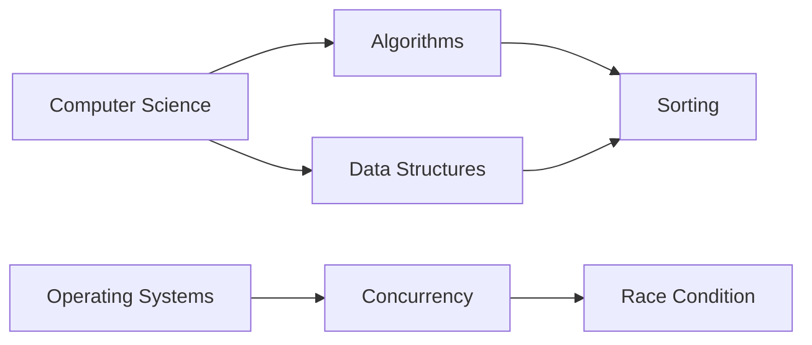

# 06 — Research Overview

Purpose: consolidate all research. Part 1 is the research recoverable from the
conversation record ([S3]) and the tooling/library citations from the chats
([S1]/[S2]). Part 2 reproduces the external deep-research report ([S7]) in full, so
this document set is self-contained. See `00_README.md` for the provenance key.

---

## PART 1 — Research recoverable from the conversation

### [S3] Earlier Research Findings Available In Context
> "The readable conversation context contains references to prior research but not
> the full research report. The findings below are therefore limited to what was
> explicitly preserved in the thread."

- Knowledge-organization research was cited as supporting the distinction between
  broader, narrower, and related relationships. This supports typed graph edges
  instead of one undifferentiated related list.
- The conversation referenced Neo4j and Graph Data Science capabilities for
  breadth-first search, depth-first search, shortest paths, Dijkstra, A*,
  centrality, community detection, and similarity.
- PostgreSQL full-text search was referenced as supporting tsvector and tsquery
  style lexical search, ranking, phrase search, and synonym/thesaurus capabilities.
- pgvector was referenced as supporting vector similarity search and approximate
  indexes such as HNSW and IVFFlat, plus hybrid search patterns with PostgreSQL
  full-text search.
- OpenSearch was referenced as a possible hybrid lexical and semantic search
  engine, but not as the recommended starting point.
- Meilisearch was mentioned as a reasonable smaller search option when typo
  tolerance and configurable search behavior are important.
- External resource examples available in the conversation include Wikipedia,
  CNCF, Kubernetes documentation, official docs, GeeksforGeeks, tutorials, videos,
  courses, books, academic material, and deep dives.

### [S1] / [S2] Tooling & library citations (with the URLs cited in-thread)
These were cited inline in the chat sessions as evidence for the architecture
recommendations:
- **Neo4j Cypher & Graph Data Science** — nodes/relationships/paths as first-class;
  BFS/DFS/Dijkstra/A*/centrality/community detection built in; BFS returns
  traversal order and supports max depth and target termination.
  (`neo4j.com/docs/cypher-manual`, `neo4j.com/docs/graph-data-science`)
- **PostgreSQL** — recursive CTE queries for hierarchical/tree traversal; full-text
  search via tsvector/tsquery, ranking, phrase search, synonym/thesaurus.
  (`postgresql.org/docs/17/queries-with.html`,
  `postgresql.org/docs/17/textsearch-intro.html`)
- **pgvector** — vector similarity search, HNSW and IVFFlat approximate indexes,
  hybrid search with Postgres FTS. (`github.com/pgvector/pgvector`)
- **OpenSearch** — hybrid keyword + semantic/vector ranking.
  (`docs.opensearch.org/.../hybrid-search`)
- **Meilisearch** — typo tolerance and configurable search out of the box.
  (`meilisearch.com/blog/typo-tolerance`)
- **3d-force-graph** — Three.js/WebGL force-directed 3D, directional arrows, curved
  links, node labels, thousands of elements, React bindings.
  (`github.com/vasturiano/3d-force-graph`)
- **React Flow** — interactive node-based interfaces: dragging, zooming, panning,
  selection, custom nodes, minimaps, controls. (`reactflow.dev`)

---

## PART 2 — The external deep-research report  ·  [S7]

Source: `deep-research-report.md` (a comprehensive external research report on
building a technical glossary site). Sections 1 and 4–10 are reproduced verbatim;
sections 2–3 are lightly condensed (a few illustrative example sentences, sample
definitions, and inline citation markers were trimmed for length).

> **Fidelity note:** the **complete, unabridged report** is preserved untouched at
> the repository root as `deep-research-report.md` — nothing was discarded. If you
> want the full text inlined here verbatim instead, say so and I will restore the
> trimmed passages.

### Executive Summary
A comprehensive technical glossary site should draw from authoritative sources
(e.g. standards bodies, academic glossaries, vendor docs) and present clear
definitions with examples and diagrams. Learning and review features
(quizzes/flashcards, spaced repetition) help reinforce knowledge. Structurally,
terms should be organized in taxonomies/ontologies (broader/narrower/related) and
prerequisite graphs, all supported by a rich data schema (term, aliases,
definition, examples, code, diagrams, related terms, difficulty, tags, sources,
revisions, etc.). The UX must support discovery (search with autocomplete, faceted
filters by field/difficulty, A–Z or hierarchical browsing) and guided learning
paths. Content reuse requires careful licensing: for example, NIST (US gov)
definitions are public domain, Wikipedia content is CC BY-SA (requiring attribution
and share-alike), and many open educational resources (e.g. MIT OCW) use CC
licenses. Practical tools include the Wikipedia/Wikidata APIs and dumps,
DBpedia/SPARQL, arXiv API, and vendor document APIs or downloadable docs.
Visualization options range from Mermaid flowcharts for hierarchies/prerequisites
to interactive network graphs for complex ontologies. Finally, community features
(revision history, talk pages, moderation, reputation/voting) and assessment
analytics (tracking quiz performance, spaced-repetition scheduling) further enhance
usability and learning.

### 1. Authoritative Sources by Field
Key sources differ by discipline, but authoritative references include standards
organizations, academic glossaries/textbooks, vendor docs, and vetted community
sites:

- **Computer Science (CS):** Wikipedia's "Glossary of computer science"
  (crowdsourced but extensive) and high-quality textbooks (e.g. *CLRS* for
  algorithms). Community tutorials like *Real Python*'s Computer Science Glossary
  provide concise definitions (e.g. "Abstract Data Type (ADT): … operations it
  supports…"). Official classifications (e.g. ACM Computing Classification Scheme)
  define taxonomies, though not easily browsed online. Authoritative content:
  *NIST* (for computing-related standards), the online Oxford/IEEE reference works
  (often paid), and academic course lecture notes (e.g. MIT OpenCourseWare).
- **Software Engineering (SE):** IEEE/ACM standards (e.g. ISO/IEC 24765 Systems and
  Software Engineering Vocabulary, or the now-legacy IEEE Std 610.12) are
  definitive, though not free. SE bodies like the *Software Engineering Body of
  Knowledge (SWEBOK)* list key terms. Reputable sources include *The Mythical
  Man-Month* or *SEI* publications. Well-known online glossaries (e.g. *Real
  Python*'s Software Engineering glossary) cover design patterns, testing, etc. QA
  sites (StackExchange, CS communities) also elaborate terms in context.
- **Platform Engineering / Cloud:** Official definitions from NIST (e.g. NIST SP
  800-145 for cloud computing) and ISO/IEC cloud computing standards. The Cloud
  Native Computing Foundation's **Cloud Native Glossary** (CNCF) is a
  collaborative, up-to-date list of cloud/DevOps terms, with tags for categories
  (e.g. "API", "DevOps", "Kubernetes"). Vendor glossaries (AWS, Azure, Google
  Cloud) define their platform terms. References like *The Google SRE Book* or
  *Azure Architecture Center* act as quasi-glossaries.
- **Artificial Intelligence (AI):** Government and academic glossaries exist. For
  example, the US Government's *AI.mil Glossary* and MIT Media Lab's **AI Glossary**
  provide definitions of AI terms. Wikipedia's AI-related entries and textbooks
  (e.g. Russell & Norvig) are key. Vendor/consortia sources: e.g. *Google AI
  Glossary*, *Oxford's AI resources*. Educational glossaries (e.g. CIRCLS "AI
  Glossary for Educators") also distill key concepts.
- **Cybersecurity:** **NIST/NCSC glossaries** are gold standards. NIST's CSRC
  glossary defines terms like "encryption", "confidentiality" with citations to
  SP 800-series (e.g. *cloud computing* defined per NIST SP 800-145). ISO/IEC 27000
  series provides security vocabulary. The **OWASP Glossary** covers web security
  terms; *SANS Institute* and *(ISC)²* publications list fundamental concepts.
  Government cybersecurity sites (e.g. US CISA, UK NCSC) offer glossaries.
  Certified-community resources (e.g. *(ISC)² Certified in Cybersecurity*
  flashcards) show how terms are taught in practice.

Each field's list would begin with standards and recognized authorities, followed
by textbooks and finally curated community pages. For example, a "Computer Science
Glossary" might rank NIST and ISO first (for formal definitions), then ACM/IEEE and
popular textbook sites, and lastly community sites like Wikipedia or specialized
blogs.

### 2. Glossary Sites with Definitions, Examples, Diagrams, References
Several online sites illustrate effective glossary entries:
- **Tutorialspoint (Data Structures Glossary):** concise definitions with
  real-world examples and diagrams. Its **Queue** entry defines FIFO and shows a
  picture of cars in a single-lane queue, plus a labeled block diagram with *Front*
  and *Rear* pointers. Lists "Related Links" and references.
- **Real Python (Glossary Pages):** crisp definitions of general CS terms (e.g.
  *"Algorithm – A finite sequence of well-defined steps…"*). Entries often include
  diagrams (a flowchart image for *Algorithm*) and link to deeper tutorial content;
  cites references and reviewer notes.
- **GeeksforGeeks (GfG):** glossary-like tutorial pages. Its **Queue Data
  Structure** page begins with a clear FIFO definition, explains uses, includes
  step-by-step sections and code snippets, plus "Practice Problems" and "Quizzes".
- **IBM Developer/Oracle/Microsoft Docs:** vendor documentation with glossaries or
  term popups, sometimes diagrams (Azure docs define cloud concepts with diagrams);
  authoritative but often not scrapable.
- **OWASP Glossary:** security terms succinctly (e.g. "XSS – a vulnerability where
  attackers inject scripts…"), linking to deeper articles with attack-scenario
  examples.
- **Academic Course Sites:** university course pages (GitHub/.edu) sometimes have
  glossary sections curated by professors (MIT OCW, Stanford class notes).
- **NIST Glossaries:** CSRC glossaries with multiple sourced definitions and
  citations to standards; formal but authoritative, often listing synonyms.

Pattern: **concise definition, followed by examples or analogies, visual aids
(diagrams, flowcharts), and references or links.**

### 3. Quiz/Flashcard Sites and Structures
- **Multiple-Choice Quizzes:** e.g. GfG embeds MCQ quizzes at the end of tutorials
  (question text + four options, answer after submission).
- **Flashcards (Term⇄Definition):** Quizlet, Flashcards.io, Brainscape, Anki host
  user-compiled decks (e.g. a "Cyber Security Flashcards" set: term on one side,
  definition on flip). Most allow tagging by subject and ordering by category.
- **Q&A or Practice Problems:** StackExchange, Hackerrank, Coursera concept-check
  quizzes; Khan Academy short quizzes; mix of multiple choice, true/false, short
  answer.
- **Structured Flashcard Layout:** *(ISC)² Cybersecurity flashcards* on GitHub
  present definitions as prompts and terms as answers in a simple markdown format
  (e.g. "1. Security commensurate with the risk … > Adequate Security").
- **Learning Sites with Embedded Qs:** edX/Udemy include quizzes after glossary
  sections ("Which of these is a valid queue operation?").

Formats: MCQs, direct term-definition flashcards, and interactive platform quizzes;
typically **term (or question) → multiple answers or free-response → immediate
feedback**.

### 4. Modelling Term Relationships (Hierarchies, Ontologies, Prerequisites)
- **Hierarchies/Taxonomies:** parent–child categories (ACM CCS). In glossaries,
  "broader term"/"narrower term" links. ISO 2788/5964 use **Broader Term (BT)** and
  **Narrower Term (NT)** labels (e.g. *Queue* NT of *Data Structure*).
- **Associative Links:** non-hierarchical relations ("see also", "related concept")
  via **Related Term (RT)** — "a reciprocal relationship… not hierarchical". SKOS
  formalizes with `skos:broader`, `skos:narrower`, `skos:related`.
- **Ontologies (RDF/OWL):** terms as classes/instances; subclass (is-a) or part-of
  in OWL. Example:
  ```xml
  <owl:Class rdf:about="#HighOrderLanguage">
    <rdfs:subClassOf rdf:resource="#ProgrammingLanguage"/>
  </owl:Class>
  ```
- **Prerequisite Graphs:** one concept required before another, modeled as a DAG
  (Khan Academy's "Knowledge Map" links topics by prerequisite). Helps recommend
  learning paths.
- **Abstraction Levels:** High-level language vs Assembly vs Machine code — a
  "levels" chain (a form of taxonomy/subclass).
- **Cross-Field Links:** link a term in one domain to related terms in another
  (e.g. "Model" in AI ↔ "Data Model" in SE) — like RTs in a multi-domain ontology.

*Visual example (Mermaid):*

Use **SKOS** for thesaurus-style (BT/NT/RT), or **OWL** for formal hierarchies.
Knowledge-graph tools (Wikidata `wdt:P279` subclass, DBpedia) expose semantic links.

### 5. Entry Data Model (Schema)
Recommended fields (reproduced also in `02_SCHEMA.md` §2h):

| Field | Type | Purpose |
|---|---|---|
| term | string | Canonical name. |
| aliases | array[string] | Alternate names, acronyms, synonyms. |
| definition | string (rich text) | Formal definition. |
| examples | array[string\|object] | Examples/analogies. |
| code_snippets | array[string] | Example code. |
| diagrams | array[string] (URLs) | Diagrams/images. |
| related_terms | array[obj] | Related concepts with relation type. |
| difficulty | string (enum) | Learner level. |
| tags | array[string] | Categories/keywords. |
| sources | array[string] (URLs) | References. |
| revision_history | array[obj] | Edit history. |
| learning_items | array[obj] | Linked quiz/flashcard IDs. |
| assessment_items | array[obj] | Questions (flashcards / quiz Q&A). |
| metadata | object | Created date, license, etc. |

Example JSON entry:
```json
{
  "term": "Queue",
  "aliases": ["FIFO queue"],
  "definition": "A linear data structure where the first element added is the first one to be removed (First-In-First-Out).",
  "examples": ["A line of people waiting to buy tickets is a real-world queue."],
  "code_snippets": ["Queue<int> q; q.enqueue(5); // adds 5 to the queue"],
  "diagrams": ["https://example.com/queue_diagram.png"],
  "related_terms": [
    {"term": "Stack", "relation": "contrast"},
    {"term": "FIFO", "relation": "synonym"}
  ],
  "difficulty": "Beginner",
  "tags": ["data structure"],
  "sources": ["https://en.wikipedia.org/wiki/Queue_(abstract_data_type)"],
  "revision_history": [{"date":"2026-08-01","editor":"user123","changes":"Initial creation"}],
  "learning_items": [{"type":"flashcard","id":"card456"}],
  "assessment_items": [{"question":"What order does a queue follow?","answer":"First In, First Out"}],
  "metadata": {"created":"2026-08-01","last_updated":"2026-09-01","license":"CC-BY-4.0"}
}
```
Implementable as a relational table or NoSQL document; supports search by tag,
filter by difficulty; `related_terms` stores relation type (is_a, part_of,
see_also); revision history and source URLs support transparency and credit.

### 6. UX/Navigation Patterns
- **Search with Autocomplete:** prominent search box, suggestions including
  aliases, synonyms and fuzzy/typo correction, "search as you type".
- **Faceted/Filtered Navigation:** filters for field/domain (CS, AI, Security),
  difficulty, category tags, alphabet. (NN/g advises faceted navigation for complex
  datasets; CNCF tags each term with categories.)
- **Alphabetical / Hierarchical Index:** classic A–Z; or an expandable tree
  sidebar (Programming Languages → Python, Java; Algorithms → Sorting, Graphs);
  breadcrumbs or tree view.
- **Related Links & "See Also":** per-term related terms (with relation types) as
  clickable links, implicitly forming a browsing graph.
- **Learning Paths/Guidance:** recommended sequences ("Variables" → "Data Types" →
  "Control Flow"); curriculum views; analytics-adapted next terms (spaced
  repetition surfaces wrong answers more often).
- **Responsive Design & History:** mobile-friendly; "Recently viewed"/bookmarks;
  revision dates and authors.
- **Search Result Refinement:** refine broad searches via facets/filters (e.g.
  after "network", filter by protocol/hardware/concept).

Best practice: a blend of free-text search plus faceted browse.

### 7. Licensing and Attribution
- **Public Domain/Government:** US federal works (NIST) are not copyrighted; NIST
  SP800 glossary definitions can be reused freely (attribution good practice).
- **Creative Commons:** Wikipedia/Wikidata text is CC BY-SA 3.0/4.0 (credit +
  share-alike); CNCF Glossary is CC BY 4.0; MIT OCW is CC BY-NC-SA 4.0
  (non-commercial, attribution, share-alike).
- **StackExchange/StackOverflow:** user content (incl. tag wikis) is CC BY-SA
  (currently 4.0) — reuse with credit + share-alike.
- **Other Sites:** commercial vendors (Microsoft, Oracle) reserve copyright; don't
  scrape wholesale; paraphrase or link back. Tutorial sites (GeeksforGeeks,
  Tutorialspoint) generally don't grant reuse — use as guidance and cite.
- **Fair Use:** limited quotation with citation may qualify; a whole glossary entry
  likely exceeds it. Prefer public-domain or permissively licensed sources.

Always include source references. For CC content follow the license (list
authors/link). For proprietary content prefer linking over copying.

### 8. Tooling & Data Sources
- **Wikimedia APIs and Dumps:** MediaWiki API (`action=query&prop=extracts`);
  Wikidata labels/descriptions via SPARQL or REST; monthly wikitext dumps.
- **Wikidata Query Service (SPARQL):** structured data — QIDs, aliases, hierarchy.
- **DBpedia:** RDF triples from Wikipedia; SPARQL endpoint/dumps for abstracts and
  categories.
- **ArXiv API:** Atom-based; harvest emerging terms from research abstracts.
- **Literature/Corpus Mining:** Scholar/Crossref APIs; NLP to extract definitions;
  OCR/ML on textbooks (license issues).
- **Vendor/Platform APIs:** NVD (vulnerabilities) has APIs; cloud providers rarely
  offer glossary APIs but docs can be parsed if allowed.
- **Community Q&A APIs:** Stack Exchange API for tag-wiki excerpts (CC BY-SA).
- **ConceptNet:** open knowledge graph with an API for related terms/definitions
  (CC BY-SA) — useful for synonyms/related concepts.
- **Automation/Update Tools:** cron jobs / cloud functions running SPARQL/MediaWiki
  API calls or scheduled dumps; timestamp updates in `revision_history`.

Mixed approach: open databases (Wikidata, DBpedia) for breadth + targeted scraping
(respecting robots.txt/licenses) for niche terms.

### 9. Visualizations for Relationships
- **Directed Graphs (Flowcharts):** hierarchies/prerequisites; Mermaid `graph LR`;
  labelled edges for relation type; trees/mind-maps for simple hierarchies.
- **Entity-Relationship (ER) Diagrams:** Mermaid ER/ClassDiagram for ontologies /
  data modeling.
- **Network Graphs:** force-directed (D3.js, Cytoscape) for many interconnected
  terms; nodes = terms, links = BT/NT/RT; highlight paths.
- **Flow Diagrams:** process-oriented relations (data flow, dependency chains).
- **Mind Maps:** brainstorming synonyms/associations.
- **Tables/Matrix Charts:** prerequisites as a dependency matrix at scale.
- **Ontological Hierarchies:** SNOMED/BioPortal-style collapsible tree navigators.

Which to use: hierarchies/is-a → tree/flowchart; part-of/prerequisites → directed
graphs; associative → undirected/bidirectional; temporal/process → flowchart;
mixed/complex → interactive network graph library.

### 10. Additional Features
- **Versioning & Revisions:** track changes, diffs, rollback (wiki-style);
  `revision_history` field.
- **Community Contributions & Moderation:** suggest edits/new terms; peer review or
  moderator approval; reputation/points (StackExchange model → largely
  self-moderating); talk/discussion pages.
- **Assessment Analytics:** track quiz/flashcard performance; aggregate stats
  ("80% answered correctly"); dashboards ("Most-searched", "Most-quizzed").
- **Spaced Repetition Scheduling:** SRS with per-term interval scores; revisit
  based on recall history (1 day → 3 days → a week).
- **Gamification:** badges for streaks/contributions; points for completing
  "chapters"; progress bars/levels.
- **Discussion/Comments:** per-term Q&A surfacing nuances.
- **Internationalization:** switch languages (Wikidata translations).
- **Offline or Export:** CSV/PDF export for offline study.
- **Integration with Learning Resources:** link terms to tutorials/books/courses,
  creating a learning path.

**References note [S7]:** recommendations are supported by UX research (NN/g on
faceted search), Wikipedia/StackExchange licensing guidelines, NIST public-domain
policy, MIT/OCW licensing, and examples from real glossaries.
